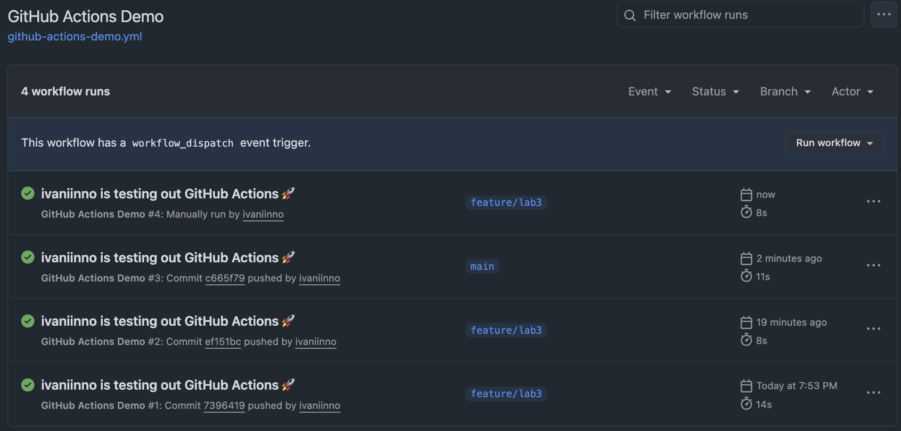
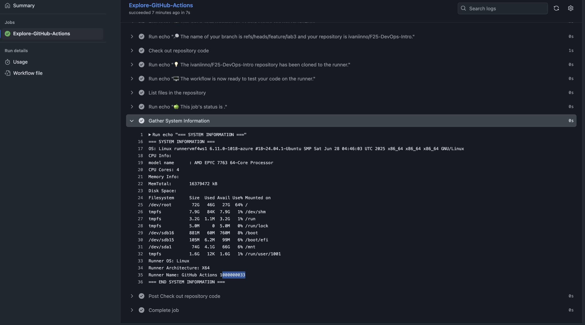

# Lab 3 Submission - CI/CD with GitHub Actions

## Task 1 — First GitHub Actions Workflow 

### Steps followed
I read that GitHub Actions helps automate work and decreasse uncertainces by following a predefined set of instructions. Then I explored existing workflow templates. \
After getting familiar with the GitHub Actions, I step by step implemented a short tutorial present on the page:
- create a very basic file located in `.github/workflows/` named `github-actions-demo.yml`
- insert suggested code 
- commit changes
After that, I navigated to the Actions page of my repository and saw running workflow. Seconds later, I noticed a successfully ended workflow. I explored the job and some logs.

### Key Concepts Learned

**Jobs**: A job is a set of steps that execute on the same runner. In this workflow, we have one job called "Explore-GitHub-Actions" that runs on an Ubuntu runner.

**Steps**: Individual tasks within a job. Each step either:
- Runs a shell command (e.g., `run: echo "..."`)
- Use an action (`uses: actions/checkout@v5`)

**Runners**: Virtual machines that execute the workflow. Our workflow uses `ubuntu-latest`, which is a GitHub-hosted runner with Ubuntu Linux.

**Triggers**: Events that cause a workflow to run. Our workflow uses `on: [push]`, meaning it runs every time code is pushed to the repository.

**Actions**: Reusable units of code that perform specific tasks. We use `actions/checkout@v5` to clone the repository code to the runner.

### What Caused the Run to Trigger
The workflow was triggered by a **push event** to the repository. When I pushed the workflow file to the `feature/lab3` branch, GitHub Actions automatically detected the new workflow file and executed it.

### Workflow Run Evidence
- **Run Link**: [workflow](https://github.com/ivaniinno/F25-DevOps-Intro/actions/workflows/github-actions-demo.yml)
- **Trigger Event**: Push to `feature/lab3` branch file `.github/workflows/github-actions-demo.yml`
- **Status**: [Success](https://github.com/ivaniinno/F25-DevOps-Intro/actions/runs/17864630914) with running time 14s

---

## Task 2 — Manual Trigger + System Information 

### Changes Made to Workflow File

I extended the existing GitHub Actions workflow to include:

- **Manual Trigger**: Added `workflow_dispatch:` to the `on:` section, allowing manual execution from the GitHub UI.

After I ran workflow manually, I additionally added a command for gathering system information as follows:

```yaml
on: 
  push:
  workflow_dispatch:  # Added manual trigger

# Added new command:
- name: Gather System Information
  run: |
    echo "=== SYSTEM INFORMATION ==="
    echo "OS: $(uname -a)"
    echo "CPU Info:"
    cat /proc/cpuinfo | grep "model name" | head -1
    echo "CPU Cores: $(nproc)"
    echo "Memory Info:"
    cat /proc/meminfo | grep "MemTotal"
    echo "Disk Space:"
    df -h
    echo "Runner OS: ${{ runner.os }}"
    echo "Runner Architecture: ${{ runner.arch }}"
    echo "Runner Name: ${{ runner.name }}"
    echo "=== END SYSTEM INFORMATION ==="
```

### Manual Workflow Execution
`workflow_dispath` do not provide `run workflow` command until workflow file is merged into main, I did this and then successfully ran it manually: 2nd run is automatic when I updated the file, 3rd is automatic when I merged `feature/lab3` with the only file `.github/workflows/github-actions-demo.yml`, and the 4th one is manual, as one can see: 

### System Information Gathered
The workflow now captures comprehensive system information from the GitHub-hosted runner, including hardware specifications and operating system details, which is useful for debugging and understanding the execution environment: [Link to the run](https://github.com/ivaniinno/F25-DevOps-Intro/actions/runs/17866976689)
